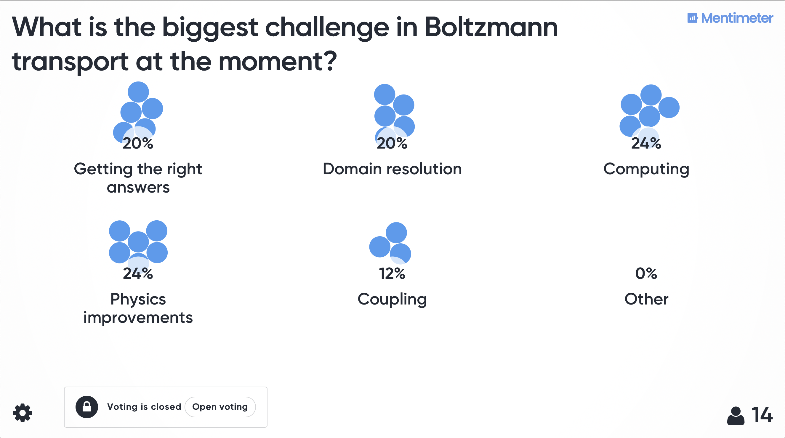

## Boltzmann transport applications meeting
10:00 - 16:30, Wednesday 4th December 2019

The meeting is centred on bringing together academics and industry that work on solving Boltzmann-type problems in a range of different application areas. The idea behind this meeting is to try and foster collaboration between different disciplines, to exchange knowledge on methods and tools and help improve all our abilities in tackling difficult multi-dimensional Boltzmann problems.

This year, the meeting will be hosted by the Applied Computational and Modelling Group (AMCG) at Imperial College London and we believe would be of interest to mathematicians, scientists and engineers in fields as diverse as:
- Nuclear engineering
- Radiative transfer in different disciplines
- Lattice Boltzmann methods for fluids
- Astrophysics
- Vlasov/Boltzmann equations
- Spectral wave modelling
- Medical radiation
- Reduced order modelling for Boltzmann applications

The meeting will be comprised of a series of 20-30 minute talks, along with focused discussion sessions. The first talk in the morning session will give an introduction to Boltzmann transport modelling in different applications, with the aim of setting a common language to facilitate discussions that follow.


### Location
```
Imperial College London
Royal School of Mines building
RSM 1.51 (Level 1)
```
[Map](https://goo.gl/maps/XHnmV2xEwhuS2ma28)

### Organisers
[Steven Dargaville](https://www.imperial.ac.uk/people/s.dargaville) (Imperial College London) and [Tom Deakin](http://www.tomdeakin.com/cs/) (University of Bristol)


### Agenda
This is the rough plan for the day, but the timings are flexible to allow plenty of time for discussions.
<table>
  <tr>
    <th>Time</th>
    <th>Session</th>
    <th>Speaker</th>
  </tr>
  
  <tr><td colspan="3"><b>Introduction</b></td></tr>
  
  <tr>
  <td>10:00 - 10:30</td>
  <td colspan="2">Arrival and tea & coffee</td>
  </tr>
  <tr>
  <td>10:30 - 10:50</td>
  <td><a href="slides/welcome.pdf">Welcome and Introductions</a></td>
  <td>Tom Deakin and Steven Dargaville</td>
  </tr>
  <tr>
  <td>10:50 - 11:25</td>
  <td>General Boltzmann & applications</td>
  <td>Steven Dargaville</td>
  </tr>
  
  <tr><td colspan="3"><b>Neutronics and nuclear applications</b></td></tr>
  
  <tr>
  <tr>
  <td>11:25 - 11:45</td>
  <td>Transport on many-core architectures</td>
  <td>Tom Deakin</td>
  </tr>
  <td>11:45 - 12:05</td>
  <td>Adaptivity for Boltzmann</td>
  <td>Giannis Nikiteas (Steven Dargaville)</td>
  </tr>
  <tr>
  <td>12:05 - 12:25</td>
  <td>Industry requirements in nuclear applications</td>
  <td>Paul Smith</td>
  </tr>
  <tr>
  <td>12:25 - 12:45</td>
  <td>Neutronics at ISIS</td>
  <td>Steve Lilley</td>
  </tr>
  
  <tr><td colspan="3"></td></tr>
  <tr>
  <td>12:45 - 13:35</td>
  <td colspan="2"><b>Lunch</b></td>
  </tr>
  <tr><td colspan="3"></td></tr>
  
  <tr><td colspan="3"><b>Reduced order modelling</b></td></tr>
  <tr>
  <td>13:35 - 13:55</td>
  <td>POD for neutronics</td>
  <td>Claire Heaney</td>
  </tr>
  <tr>
  <td>13:55 - 14:15</td>
  <td>Neural networks and ROM</td>
  <td>Toby Phillips</td>
  </tr>
  <tr>
  <td>14:15 - 14:35</td>
  <td>ROM for neutronics</td>
  <td>Andrew Buchan</td>
  </tr>
  
  <tr><td colspan="3"></td></tr>
  <tr>
  <td>14:35 - 15:00</td>
  <td colspan="2"><b>Tea break</b></td>
  </tr>
  <tr><td colspan="3"></td></tr>
 
  <tr><td colspan="3"><b>Multiphysics and coupling</b></td></tr>
  <tr>
  <td>15:00 - 15:20</td>
  <td>Matrix based sweep-free deterministic transport</td>
  <td>Richard Smedley-Stevenson</td>
  </tr>
  <tr>
  <td>15:20 - 15:35</td>
  <td>Multiphase fluids coupling</td>
  <td>Liang Yang</td>
  </tr>
  <tr>
  <td>15:35 - 15:55</td>
  <td>Plasma physics applications</td>
  <td>Aidan Cilly & Brian Appelbe</td>
  </tr>
  <tr>
  <td>15:55 - 16:20</td>
  <td>Boltzmann multiphysics</td>
  <td>Chris Pain</td>
  </tr>
  
  <tr><td colspan="3"><b>Boltzmann discussion</b></td></tr>
  <tr>
  <td>16:20 - 16:30</td>
  <td colspan="2">Discussion and wrap up</td>
  </tr>
  
</table>


### Boltzmann challenges questionnaire



### Photos
<script src="https://cdnjs.cloudflare.com/ajax/libs/jquery/2.1.1/jquery.min.js" type="text/javascript"></script>
<link  href="https://unpkg.com/nanogallery2@2.4.2/dist/css/nanogallery2.min.css" rel="stylesheet" type="text/css">
<script  type="text/javascript" src="https://unpkg.com/nanogallery2@2.4.2/dist/jquery.nanogallery2.min.js"></script>
<div id="nanogallery2" data-nanogallery2 = '{"thumbnailHeight":  150, "thumbnailWidth":   150, "itemsBaseURL":     "photos/"}' >
                      
<!-- gallery content -->
<a href = "IMG_2820.jpeg"   data-ngThumb = "IMG_2820.jpeg" > Photo 01 </a>
<a href = "IMG_2821.jpeg"   data-ngThumb = "IMG_2821.jpeg" > Photo 02 </a>
<a href = "IMG_2822.jpeg"   data-ngThumb = "IMG_2822.jpeg" > Photo 03 </a>
<a href = "IMG_2823.jpeg"   data-ngThumb = "IMG_2823.jpeg" > Photo 04 </a>
<a href = "IMG_2824.jpeg"   data-ngThumb = "IMG_2824.jpeg" > Photo 05 </a>
<a href = "IMG_2825.jpeg"   data-ngThumb = "IMG_2825.jpeg" > Photo 06 </a>
<a href = "IMG_2826.jpeg"   data-ngThumb = "IMG_2826.jpeg" > Photo 07 </a>
<a href = "IMG_2827.jpeg"   data-ngThumb = "IMG_2827.jpeg" > Photo 08 </a>
<a href = "IMG_2828.jpeg"   data-ngThumb = "IMG_2828.jpeg" > Photo 09 </a>
<a href = "IMG_2830.jpeg"   data-ngThumb = "IMG_2830.jpeg" > Photo 10 </a>
<a href = "IMG_2831.jpeg"   data-ngThumb = "IMG_2831.jpeg" > Photo 11 </a>
<a href = "IMG_2832.jpeg"   data-ngThumb = "IMG_2832.jpeg" > Photo 12 </a>
<a href = "IMG_2833.jpeg"   data-ngThumb = "IMG_2833.jpeg" > Photo 13 </a>

</div>
<!-- ### end of the gallery definition ### -->


### Contact

Please email the organisers: [Steven Dargaville and Tom Deakin](mailto:s.dargaville@imperial.ac.uk,tom.deakin@bristol.ac.uk).

